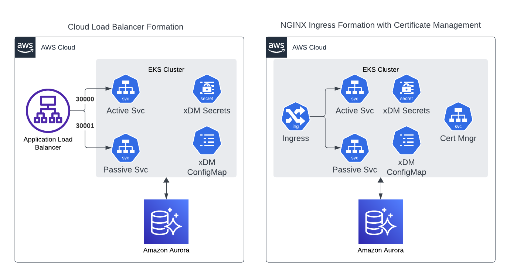

## Introduction
This chart will deploy [Semarchy](https://semarchy.com) xDM into a Kubernetes cluster. By default, it will create a high-availability xDM configuration. This means one active node and many passive nodes in [xDM HA terminology](https://www.semarchy.com/doc/semarchy-xdm/xdm/5.3/Install/high-availability.html).

For the load-balancer, you can either use a cloud load-balancer of your choice (AWS ELB, Azure Application Gateway, etc.), or Kubernete's native NGINX which is pre-packaged as a subchart. 



### Usage
#### Cloud Load Balancer
In the cloud load balancer configuration, the active node and passive node(s) are exposed as [NodePort](https://kubernetes.io/docs/concepts/services-networking/service/#type-nodeport) services. By default, the services are exposed as ports:
- Active Service: 30000
- Passive Service: 30001

These values can be changed with the _set_ command. Please make sure the load balancer is configured for:
- Session affinity with load balancer-generated cookies
- SSL offloading
  

Example Installation:
```
helm install xdm-dev . \
--create-namespace xdm-dev
--set xdm_repository_driver: org.postgresql.Driver \
--set xdm_repository_url: jdbc:postgresql://<cluster-ip-address>:<cluster-port>/semarchy_repository \
--set xdm_repository_username: semarchy_repository \
--set xdm_repository_password: semarchy_repository \
--set xdm_repository_ro_username: semarchy_repository_ro \
--set xdm_repository_ro_password: semarchy_repository_ro
```

#### NGINX Ingress Load Balancer
For this configuration, the ingress will expose a single IP address outside of the cluster. You will need to register two DNS names against this address. One for the active service and another for the passive service.  

Optionally, this configuration can also handle SSL certificate management. The certificates are automatically generated by [LetsEnrcypt](https://letsencrypt.org/) using the HTTP01 solver.

Example Installation:
```
helm install xdm-dev . \
--create-namespace xdm-dev
--set ingress-nginx.enabled: true \
--set cert-manager.enabled: true \
--set active_host_name: xdma.mydomain.com \
--set passive_host_name: xdm.mydomain.com \
--set acme_registration_email: john.smith@contoso.com \
--set xdm_repository_driver: org.postgresql.Driver \
--set xdm_repository_url: jdbc:postgresql://<cluster-ip-address>:<cluster-port>/semarchy_repository \
--set xdm_repository_username: semarchy_repository \
--set xdm_repository_password: semarchy_repository \
--set xdm_repository_ro_username: semarchy_repository_ro \
--set xdm_repository_ro_password: semarchy_repository_ro
```

Retrieve Ingress IP Address:
```
kubectl get ingress xdm-ingress --namespace xdm-dev
```
